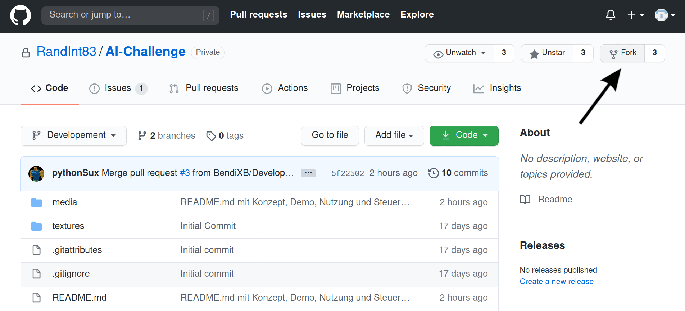
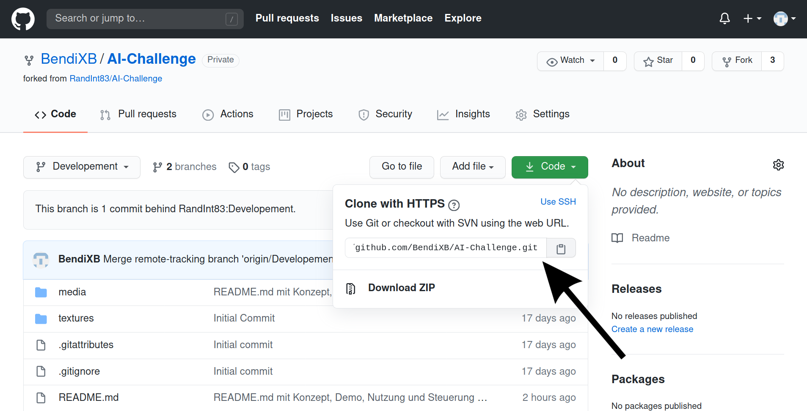
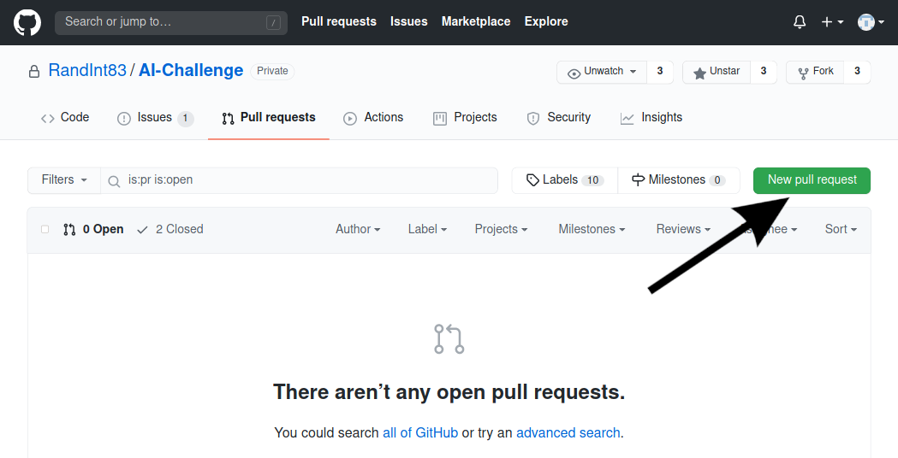
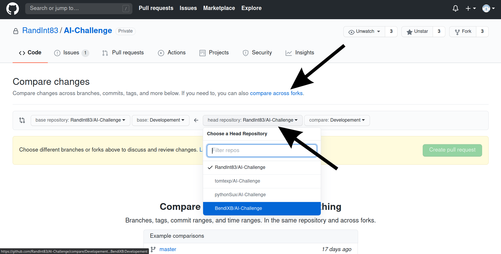
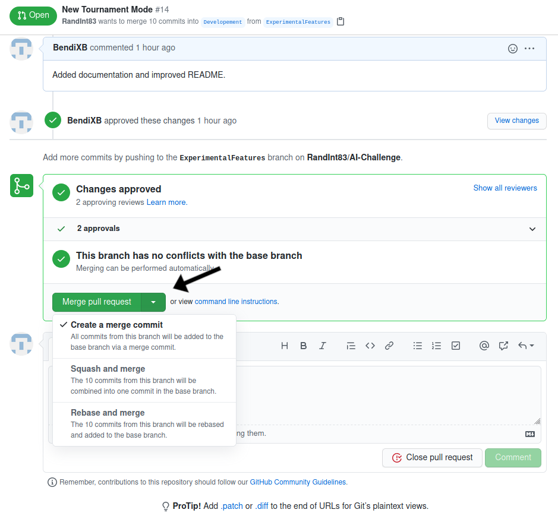

## Entwicklung
Das Projekt hat zwei Entwicklungszweige, *master* und *Development*.

Master enthält das ursprüngliche Programm und in ihm arbeitet nur @RandInt83.
Development ist der Hauptzweig in dem die gemeinschaftliche Entwicklung stattfindet.

### Workflow
Um ein neues Feature oder ein Bugfix in das Projekt einzubringen ist der Workflow zu folgen:

1. Erstelle einen Fork des RandInt83/AI-Challenge Repository.  
In dieser Kopie des Repositories in deinem Github Account kannst du nun die Änderungen vornemen.  

2. Clone den Fork auf deinen Computer um an ihm zu arbeiten.  

Kopiere den Link zum Fork und clone ihn mit   `git clone https://github.com/USERNAME/AI-Challenge.git`  
In Pycharm kann ein Repository mit der Funktion `Get from Version Control` geclont werden.

3. Mache nun die Änderungen am Code oder füge neuen hinzu.  
Neue Dateien müssen mit `git add file.py` zum Repository hinzugefügt werden.

4. Nach Jedem neuen Feature oder Bugfix sollte ein eigener Commit mit Beschreibung zu Git hinzugefügt werden.  
Mit dem Befehl `git commit -m "Ausführliche Beschreibung des Commits"` werden alle vorherigen Änderungen in Git aufgenommen.  

5. Wenn alle Verbesserungen gemacht sind können alle commits mit `git push` auf GitHub in den Fork hochgeladen werden.

6. Um den Code nun zum Projekt bezutragen muss eine Pull Request erstellt werden.
Eine Pullrequest ist die Anfrage die commits in einem Fork in das Projekt aufzunemen.
Dazu muss auf der Github Seite des Projektes der Reiter Pull Requests ausgewählt werden.

Zuerst müssen Fork und Projekt verglichen werden. Dazu muss 'compare accross Forks' ausgewählt werden.
Dann muss das Projekt Randint/AI-Challenge branch:Development mit deinem Fork verglichen werden.

Wenn keine Konflikte bestehen, die auftreten könnten wenn z.B. eine Zeile von mehreren Entwicklern verändert worden wäre.
Mit einer treffenden Beschreibung kann jetzt die Anfrage eingereicht werden.

7. Die Pullrequest wird nun in den Kommentaren diskutiert und wenn sie getestet wurde von jemandem in das Projekt gemerged.  
ollte noch an der Request etwas verändert werden sollen kann einfach ein neuer Commit in den Fork gepusht werden.
Beim mergen sollte *squasch and merge* verwendet werden um alle commits der Pullrequest zusammenzufassen und übersichtlich ein zu binden.

Alle Aktionen können bequem aus einer IDE wie Pycharm Professional getätigt werden und benötigen nicht zwagsweise eine Komandozeile.

---
Relevanter XKCD:  
