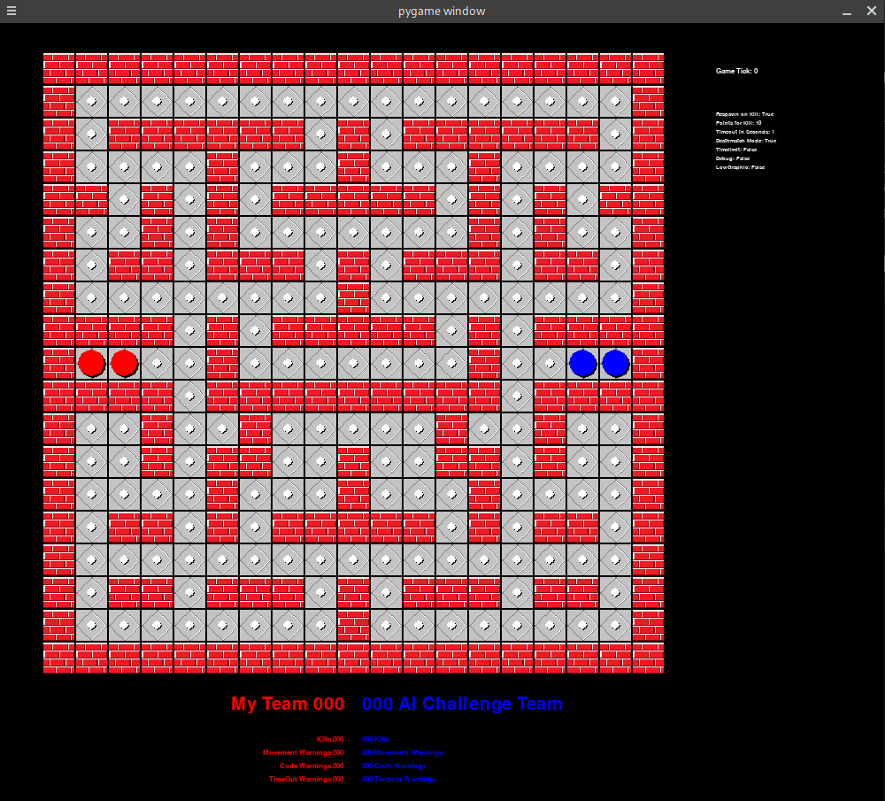
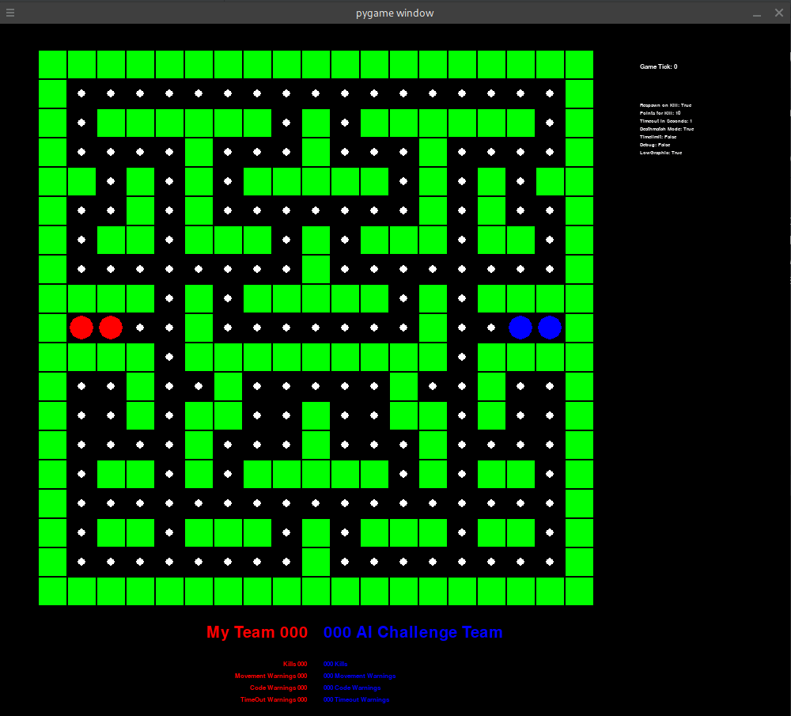
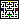
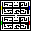
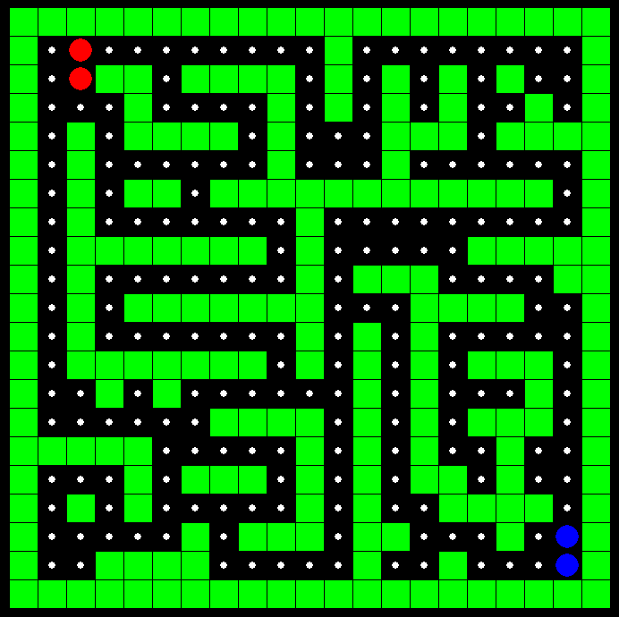
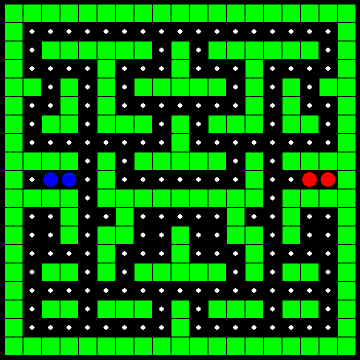
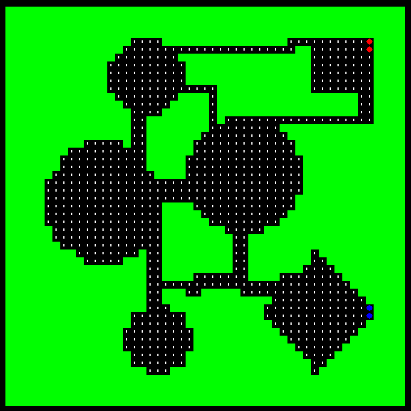
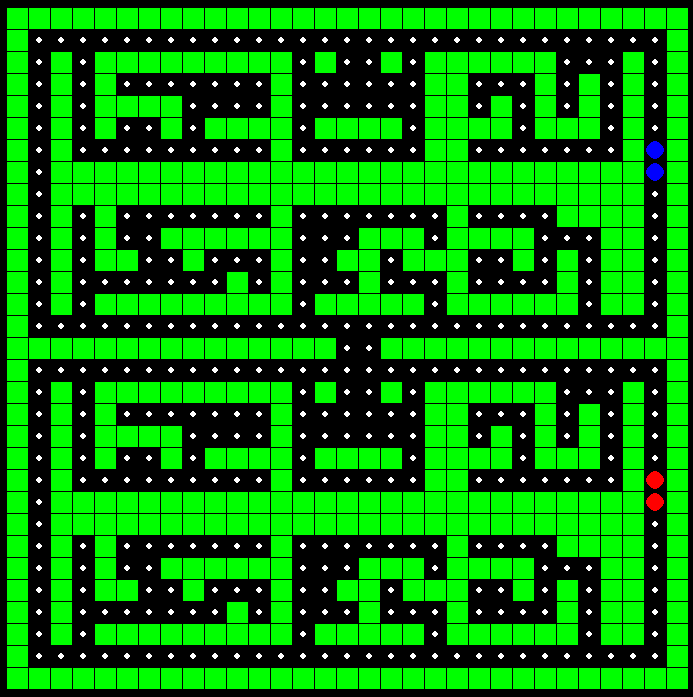

# Multiplayer Pacman AI-Challenge

## Konzept

Es treten zwei Bots gegeneinander an. Es sind Beispiele ethalten, eigene Bots können als Klassen in bot.py implementiert werden.

Das Spielfeld ist wie ein Pacman-Labyrinth aufgebaut. Die Bots treten mit ein oder zwei Figuren gegeneinander an.
Es wird abwechselnd um jeweils ein Feld weitergezogen. Es gibt die Möglichkeit, nicht zu ziehen.

Derjenige Bot gewinnt, dessen Punktzahl am Ende des Spiels die höchste ist.

|Aufwendige Grafik                                           | Einfache Grafik                                           |
:-----------------------------------------------------------:|:----------------------------------------------------------:
|  |  |

## Nutzung

0. Repository herunterladen  
Es gibt zwei Entwicklungszweige: den offiziellen *master* und den gemeinschaftlich entwickeltelten *development*  
Lade nun das Repository als ZIP-Archiv herunter oder clone es mit git.   `git clone https://github.com/RandInt83/AI-Challenge.git`

1. Instaliere Abhängigkeiten  
Zum Ausführen werden Numpy, Pygame und Matplotlib benötigt.
Instaliere sie mit pip   `pip3 install numpy pygame matplotlib`

(Optional)
Eine Text-To-Speech Engine kann ein durchgeführtes Turnier moderieren. Hierfür
ist eine Installation des Pakets pyttsx notwendig   `pip3 install numpy pygame matplotlib`

2. Programm starten  
Starte das Programm mit Python 3.x   `python3 main.py`

## Steuerung
Taste | Funktion
:---:|:---:
`0` | Spiel starten
`6` | Pausieren
`r` | Spiel neustarten
`q` | Spiel beenden
`t` | Grafik von Einfach auf Aufwendig schalten
`1` | Bildwiederholrate auf 1 FPS
`2` | Bildwiederholrate auf 3 FPS
`3` | Bildwiederholrate auf 10 FPS
`4` | Bildwiederholrate auf 20 FPS
`5` | Bildwiederholrate auf 40 FPS

## Karten erstellen
Im Verzeichniss *maps* können eigene Karten erstellt werden.
Ein Pixel entspricht einem Block auf dem Feld und seine Farbe definiert die Art des Blockes.

Die PNG-Dateien müssen mit einer Nummer ab 1 benannt sein: `M<int>.png`, also z.B. `M1.png; M2.png; M3.png`.

In `map.py` kann eingestellt werden welche Karten geladen werden sollen und ob vor dem Spiel die Karten zufällig gewählt werden sollen.

Block | Farbe | RGB-Code
:------------------:|:-------:|:----------------:
|Wand               | Schwarz | `0, 0, 0`       |
|Pellet             | Weiß    | `255, 255, 255` |
|Position Team Rot  | Rot     | `255, 0 ,0`     |
|Position Team Gelb | Gelb    | `0, 255, 0`     |
|Position Team Blau | Blau    | `0, 0, 255`     |
|Position Team Grün | Grün    | `255, 255, 0`   |

| PNG-Dateien |                      |                      |                      |                      |
|-------------|--------------------------------------------------|--------------------------------------------------|--------------------------------------------------|--------------------------------------------------|
| Karten      |  |  |  |  |

## Beitragen
In CONTRIBUTE.md befindet sich ein [Workflow](CONTRIBUTE.md) zur Mitarbeit an diesem Projekt.
